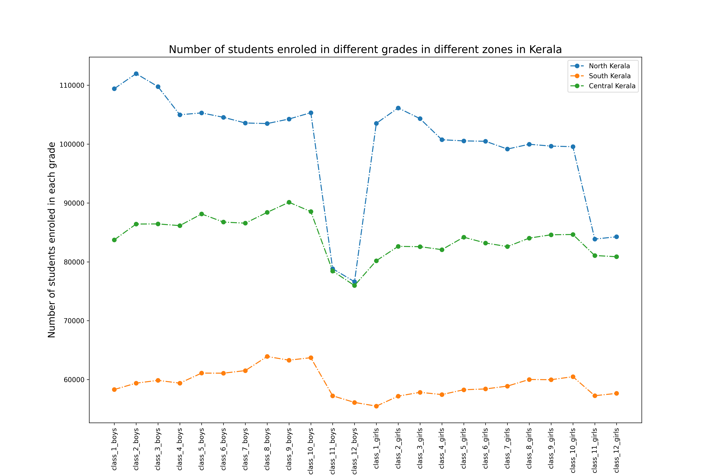
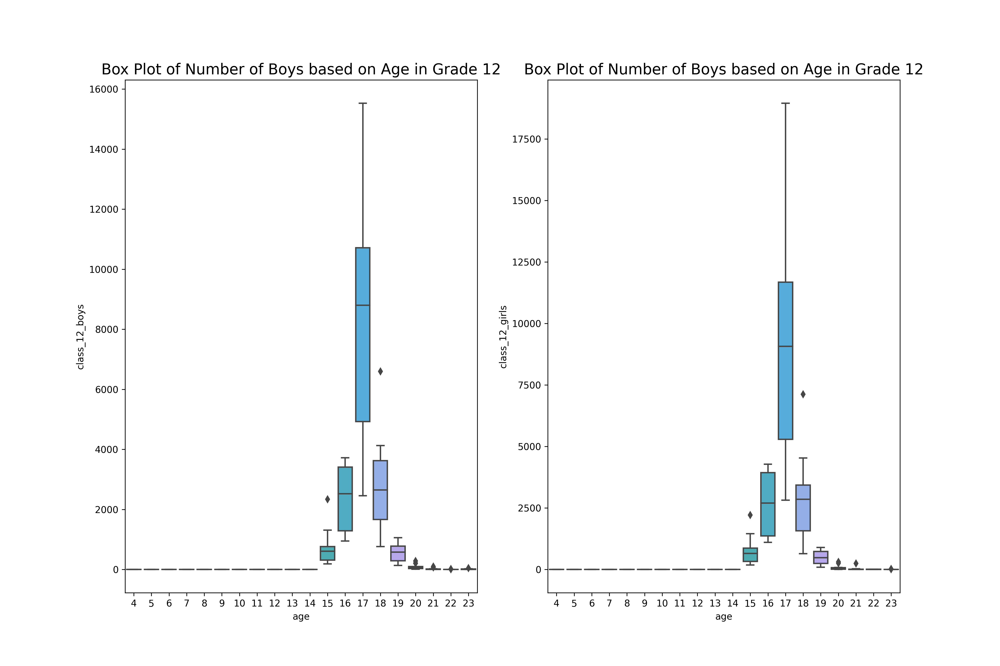

## Data Visualization

The dataset used for visualization exercise is the [Enrolment of Students in Different Grades Based on their Age in India](https://data.gov.in/resource/enrolment-age-and-class-udise-plus-during-2019-20) dataset from [data.gov.in](https://data.gov.in/). This dataset contains data of enrolment of students in different grades in all districts in India. For the visualization exercise, I have considered data of student enrolment in the districts of Kerala only. 

### Bar plot of number of boys and girls enroled in each grade in Kerala.

Bar plot is a good way to compare two quantities of interest. In this case, it is the enrolment of the number of boys and girls in each
grade. It can be observed that from grade 1 to 10, the number of boys enroled is higher than the number of girls. but in grade 11 and
12, the number of girls are more. In a state with sex ratio more than 1000 (1084, as per 2011 census), it is surprising to see that the
enrolment of girls is less than boys. But when it comes to higher grades, the drop out is more in case of boys.

### Line Plot of Students enroled in each grade in different zones of Kerala

Line plot is used to analyse the number of students enroled in different grades in different parts of Kerala. It can be observed that the
number of students enroled in schools are more in the northern part of the state owing to the higher population. We can observe a
dip in the number of students in higher grades as in the previous plot. One interesting observation is that even with large population
in the northern part of the country, the number of students enroled in and grade is same in the northern and central part of
Kerala.

### Scatter plot of girls and boys enroled in 11th and 12th grades in Kerala

It can be observed from the scatter plot that most students enroled in 11th grade is of age 16 and that of 12th grade is 17. But there
are students of age above 20 also who are enroled in these grades. Also, the number of girls are more in both 11th and 12th grades.

### Box plot

As in case of the previous plot, it is observed that the maximum number of students in 12th grade belong to 17 years in case of both
boys and girls. There are some outliers also.