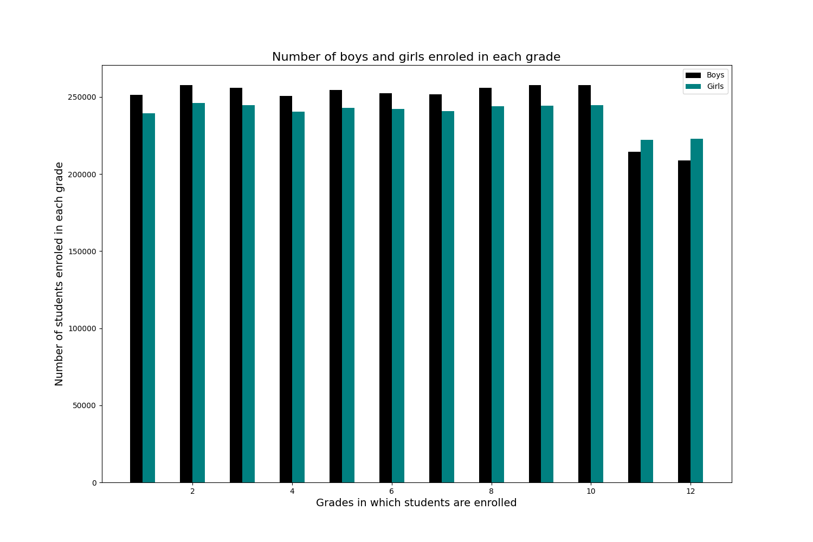

## Data Visualization

The dataset used for visualization exercise is the [Enrolment of Students in Different Grades Based on their Age in India](https://data.gov.in/resource/enrolment-age-and-class-udise-plus-during-2019-20) dataset from [data.gov.in](https://data.gov.in/). This dataset contains data of enrolment of students in different grades in all districts in India. For the visualization exercise, I have considered data of student enrolment in the districts of Kerala only. 

### Bar plot

